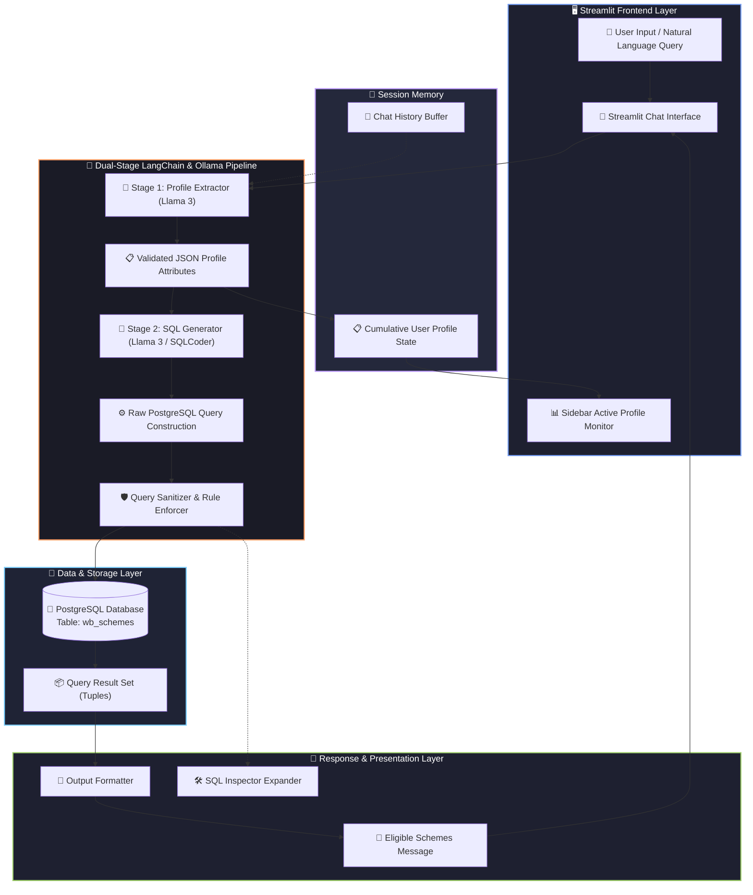

# 🛡️ West Bengal Scheme Eligibility AI Bot

[](https://www.python.org/)
[](https://streamlit.io/)
[](https://www.langchain.com/)
[](https://ollama.ai/)
[](https://www.postgresql.org/)
[](LICENSE)

> **Enterprise AI-Powered Scheme Discovery Engine**  
> An intelligent conversational AI system and interactive dashboard designed to evaluate citizen eligibility for West Bengal Government welfare schemes using natural language processing, dynamic profile extraction, and automated SQL generation over PostgreSQL.

---

## 📑 Table of Contents

- [Overview](#-overview)
- [Key Features](#-key-features)
- [Tech Stack & Symbols](#-tech-stack--symbols)
- [System Architecture & Flowchart](#-system-architecture--flowchart)
- [Database Schema](#-database-schema)
- [Project Structure](#-project-structure)
- [Prerequisites](#-prerequisites)
- [Installation & Setup](#-installation--setup)
- [Running the Application](#-running-the-application)
- [Example Queries & Chat Flow](#-example-queries--chat-flow)
- [Contributing & License](#-contributing--license)

---

## 🌟 Overview

Navigating government welfare schemes can be complex for citizens due to varying eligibility criteria across age, gender, education, income, caste, and occupation. 

The **West Bengal Scheme Eligibility AI Bot** addresses this challenge by providing a smart conversational interface that:
1. **Understands Conversational Inputs:** Accepts free-form English or Hinglish natural language messages.
2. **Maintains Cumulative Profile Memory:** Extracts demographic attributes incrementally across multi-turn dialogues.
3. **Generates Precise SQL Queries:** Translates user profiles into PostgreSQL queries using local LLMs (Meta Llama 3 / SQLCoder via Ollama).
4. **Executes & Displays Results:** Executes queries on the database and presents eligible schemes alongside transparent SQL query inspection.

---

## ✨ Key Features

- 🧠 **Dual-Stage LLM Pipeline:** Decouples profile extraction (Stage 1) from SQL synthesis (Stage 2) for maximum accuracy and zero hallucinations.
- 💾 **Contextual Multi-Turn Memory:** Retains user demographic state across conversation turns, with full support for updating or clearing individual fields.
- 🎨 **Dark-Themed Streamlit UI:** Modern dashboard featuring real-time demographic state pills, expandable SQL analytics, and instant session flushes.
- 🔒 **Zero Substring Hallucination:** Strict normalization rules preventing gender or class false-positives (e.g., distinguishing 'Male' from 'Female').
- ⚡ **Local LLM Inference with Ollama:** Runs completely offline or on-premise using Ollama models (`llama3` and `sqlcoder`) for enhanced data privacy.
- 📊 **Real-Time SQL Inspection:** Transparency drawer allowing developers and administrators to verify compiled SQL queries in real-time.

---

## 🛠️ Tech Stack & Symbols

| Category | Technology | Icon / Symbol | Purpose in Project |
| :--- | :--- | :---: | :--- |
| **Language** | **Python 3.10+** | 🐍 | Core application logic, data structures, and pipeline execution |
| **Frontend UI** | **Streamlit** | 👑 / 🔴 | Interactive dark-mode web application and live profile monitor |
| **LLM Orchestration** | **LangChain** | 🦜🔗 | Prompt templating, LCEL chains, SQLDatabase utilities, and output parsing |
| **LLM Inference** | **Ollama** | 🦙 | Local execution of Meta Llama 3 (`llama3`) and `sqlcoder` models |
| **Database** | **PostgreSQL** | 🐘 | Relational data store hosting government schemes (`wb_schemes`) |
| **DB Driver / ORM** | **psycopg2 / SQLAlchemy** | 🔌 | Python-to-PostgreSQL connection pooling and query execution |
| **Data Format** | **JSON** | 📋 | Intermediate structured data exchange for profile memory |

---

## 📐 System Architecture & Flowchart

The system implements a structured **Multi-Stage Inference & Retrieval Pipeline**:



### 🔄 Multi-Stage Flow Details:
1. **User Interaction:** The user inputs a message in plain English or Hinglish (e.g., *"I am a 17-year-old female student in class 12"*).
2. **Profile Extraction (Stage 1):** LangChain invokes `llama3` with strict extraction rules to generate a normalized JSON profile.
3. **Memory Synchronization:** The extracted JSON updates the active session profile and updates the sidebar monitor.
4. **SQL Generation (Stage 2):** The SQL Generator compiles an exact PostgreSQL condition query matching active parameters on `wb_schemes`.
5. **Database Execution:** The query is executed via `psycopg2` / `SQLDatabase`.
6. **Result Presentation:** Eligible schemes are rendered in the chat window, with an expandable drawer for reviewing the executed SQL query.

---

## 🗄️ Database Schema

The database contains the `wb_schemes` table representing West Bengal Government schemes:

```sql
CREATE TABLE wb_schemes (
    id SERIAL PRIMARY KEY,
    scheme_name VARCHAR(255) NOT NULL,
    scheme_code VARCHAR(100) NOT NULL,
    min_age INTEGER DEFAULT 0,
    max_age INTEGER DEFAULT 120,
    max_income INTEGER,
    gender VARCHAR(50),
    caste VARCHAR(50),
    marital_status VARCHAR(50),
    occupation VARCHAR(100),
    residence_area VARCHAR(100),
    school_type VARCHAR(100),
    education VARCHAR(50)
);
```

### Evaluated Profile Attributes

| Field Name | Type | Example Values | Description |
| :--- | :--- | :--- | :--- |
| `age` | Integer | `18`, `25`, `60` | User's age evaluated against `min_age` & `max_age` |
| `family_income` | Integer | `120000`, `250000` | Maximum annual income cap evaluated against `max_income` |
| `gender` | String | `Male`, `Female`, `Any` | Exact-matched gender criteria |
| `caste` | String | `SC`, `ST`, `OBC`, `General` | Caste/category matching with `Any` fallback |
| `marital_status`| String | `Single`, `Married`, `Widow` | Marital status validation |
| `occupation` | String | `Student`, `Farmer`, `Weaver` | User's current occupation |
| `residence_area`| String | `West Bengal`, `Rural`, `Urban` | Geographical eligibility |
| `school_type` | String | `Government`, `Private` | Applicable for school education schemes |
| `education` | String | `8`, `10`, `12`, `Graduate` | Current or minimum education level |

---

## 📂 Project Structure

```plaintext
├── app.py                  # 🚀 Main Streamlit web application & interactive UI
├── namah.py                # 🧠 Dual-LLM pipeline (Llama 3 + SQLCoder) backend module
├── test1.py                # 🧪 Direct Ollama + psycopg2 parametric SQL tester
├── test2.py                # 🧪 LangChain create_sql_query_chain testing script
├── database_backup.sql     # 💾 SQL Schema definition and seed data
├── readme.md               # 📖 Comprehensive project documentation
└── .gitignore              # 🚫 Git ignore rules for environment and cache files
```

---

## ⚙️ Prerequisites

Before running the project, ensure you have the following installed:

1. **Python 3.10 or higher:** [Download Python](https://www.python.org/)
2. **PostgreSQL 14+:** [Download PostgreSQL](https://www.postgresql.org/download/)
3. **Ollama:** [Download Ollama](https://ollama.ai/)
4. **Ollama Models:** Pull the required LLMs:
   ```bash
   ollama pull llama3
   ollama pull sqlcoder
   ```

---

## 🚀 Installation & Setup

### 1. Clone the Repository
```bash
git clone https://github.com/your-username/wb-scheme-ai-bot.git
cd wb-scheme-ai-bot
```

### 2. Set Up a Virtual Environment
```bash
# Windows
python -m venv venv
.\venv\Scripts\activate

# Linux / macOS
python3 -m venv venv
source venv/bin/activate
```

### 3. Install Dependencies
```bash
pip install streamlit langchain langchain-community langchain-core langchain-ollama ollama psycopg2-binary sqlalchemy
```

### 4. Configure PostgreSQL Database
Create your database and populate the `wb_schemes` table using `database_backup.sql`:

```bash
# Using psql CLI:
psql -U postgres -d postgres -f database_backup.sql
```

Update your database connection string in `app.py`:
```python
# app.py (Line 55)
postgres_uri = "postgresql+psycopg2://<username>:<password>@localhost:5432/<dbname>"
```

---

## 🖥️ Running the Application

### Launch the Streamlit Web UI
```bash
streamlit run app.py
```
Open your browser at `http://localhost:8501` to interact with the AI Bot.

### Run CLI Test Scripts
To test individual components via terminal:

- **Parametric SQL Test (`test1.py`):**
  ```bash
  python test1.py
  ```
- **LangChain SQL Chain Test (`test2.py`):**
  ```bash
  python test2.py
  ```
- **Dual-Model Inference (`namah.py`):**
  ```bash
  python namah.py
  ```

---

## 💬 Example Queries & Chat Flow

Here is how the multi-turn memory works during user conversations:

```text
User: "Hi, I am 17 years old, female and studying in 12th standard."
Bot:  "Based on your profile, you are eligible for:
      - Kanyashree Prakalpa (K2)
      - Taruner Swapna (Free Tablet Scheme)"
      [🛠️ Expander: View Compiled SQL Query]

User: "My family annual income is 120000 and caste is SC."
Bot:  "Based on your profile, you are eligible for:
      - Kanyashree Prakalpa (K2)
      - Taruner Swapna
      - Sikshashree Scheme"

User: "Clear education and set occupation to Farmer."
Bot:  "Based on your profile, you are eligible for:
      - Krishak Bandhu Scheme
      - Bangla Shasya Bima (BSB)"
```

---

## 🤝 Contributing & License

Contributions, issues, and feature requests are welcome! Feel free to check the [issues page](../../issues).

Distributed under the **MIT License**. See `LICENSE` for more information.

---

<p align="center">
  Developed with ❤️ for intelligent governance and citizen empowerment.
</p>